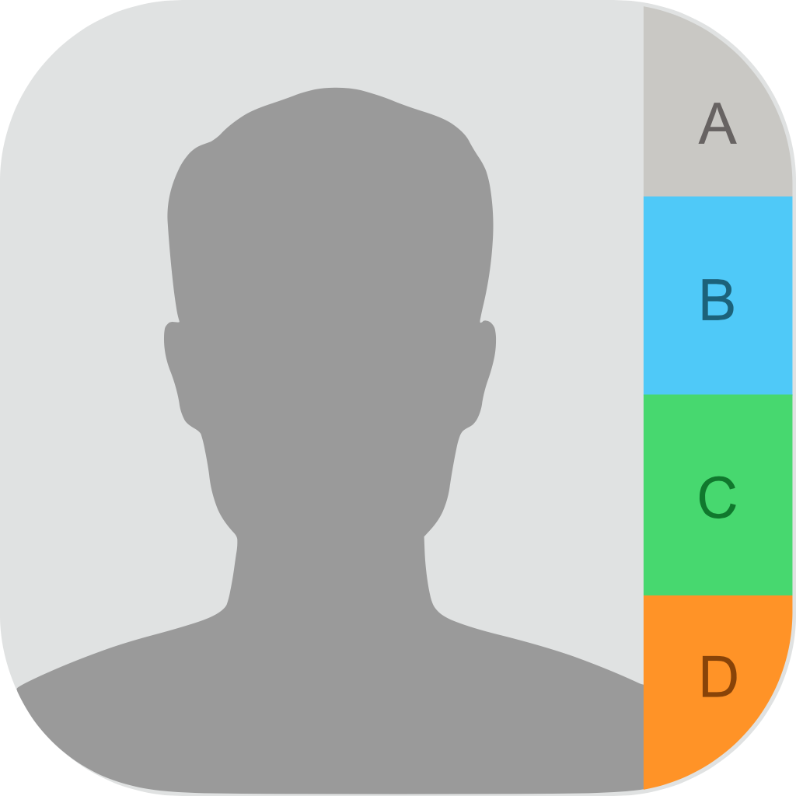

##  Contacts

>With Contacts you can store and manage your and other’s contact information. Basic as it is 👀.

## What has been implemented:
* MVC+S (kinda 👽)
* UIKit
* UITableView
* Auto Layout via Interface Builder
* Core Data
* SwiftLint

## A little demonstration:

|Add|Edit|Delete|
|:-:|:-:|:-:|
||||
